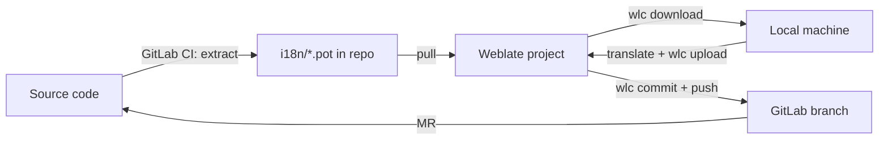

# Translation with Weblate

## Overview

This project is linked to a Weblate web project. The full round trip:

1. GitLab CI pipeline extracts `.pot` templates from source and pushes them to the repo.
2. Weblate pulls the repo, merges new `.pot` terms into each `.po` — new strings appear as untranslated.
3. The translation file is downloaded to a local machine, the user translates the missing terms, and the file is pushed back to Weblate.
4. Weblate commits and pushes the `.po` changes to a GitLab branch.
5. A merge request brings the translated `.po` files back into the source repo.



## One-time setup (Weblate CLI)

```bash
pip install wlc
```

Configure `~/.weblate` (or env vars `WLC_URL` / `WLC_KEY`):

```ini
[weblate]
url = https://weblate.example.com/api/

[keys]
https://weblate.example.com/api/ = <API_KEY>
```

Notes:

- Current `wlc` rejects `key = ...` inside `[weblate]` with
  `Error: Using 'key' in settings is insecure, use [keys] section instead.`
  The API key goes under `[keys]`, with the API URL as the option name.
- The option name under `[keys]` must match the `url` value exactly, including the trailing `/api/`.
- `url` must be the API root (`/api/` suffix). A bare server URL returns HTML and `wlc` fails with
  `Error: Server returned invalid JSON`.
- When using a project-level config (`.weblate` in the repo), `WLC_KEY` requires `WLC_URL` to also be set.

Exact flags can vary by `wlc` version — check `wlc <command> --help`.

## Local translation flow (Weblate CLI)

### 1. Check what needs translation

```bash
wlc list-translations <project>
wlc show <project>/<component>/vi
```

### 2. Download the translation file to the local machine

```bash
wlc download <project>/<component>/vi --output /tmp/weblate/vi.po
```

### 3. Translate the missing terms

Open the downloaded `.po` file locally and translate:

- Fill in the `msgstr` for every untranslated entry (empty `msgstr`).
- Keep `msgid` values untouched — they must match exactly.
- Keep Odoo placeholder syntax intact (`%s`, `%d`, `%(...)s`, `\n`, XML tags in views).
- An AI tool can assist with the translation; review its output before uploading.

### 4. Upload the file back to Weblate

```bash
wlc upload <project>/<component>/vi --input /tmp/weblate/vi.po
```

### 5. Commit and push from Weblate to GitLab

```bash
wlc commit <project>/<component>
wlc push <project>/<component>
```

### 6. Create the GitLab MR

Weblate pushes the committed `.po` changes to its GitLab branch. Open a merge request for that branch, review the `.po` diff, and merge.

## Rules

- Never edit `.po` / `.pot` files directly in the repo — translation changes go through Weblate (upload) and land via the GitLab MR.
- Repeat the flow per component that has untranslated terms.

## Server facts (verified 2026-08-18, may10-odoo-qms)

- Weblate API root: from `~/.weblate` `[weblate] url` (currently `https://translate.vdx.vn/api/`).
- Component `repo`: `https://gitlab.vdx.vn/may10/odoo-qms.git`, `branch`: `dev`, `push_branch`: `weblate-translations`, `vcs`: `gitlab` (GitLab merge request backend).
- `wlc show` does NOT print `push_branch` (wlc 2.1.1 omits it). Use `scripts/weblate_api.py push-branch` instead.
- With the GitLab MR backend, `wlc push` makes the Weblate server open the MR itself; its output contains the MR URL.
